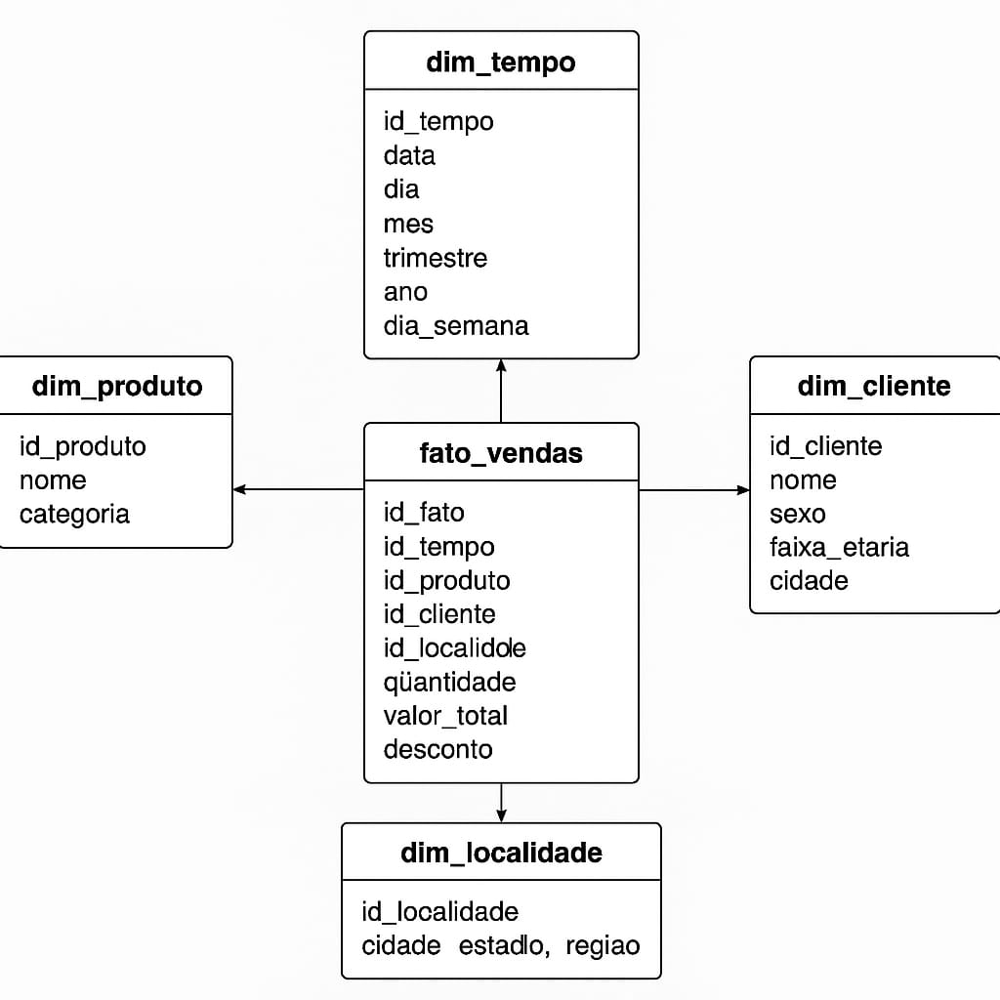
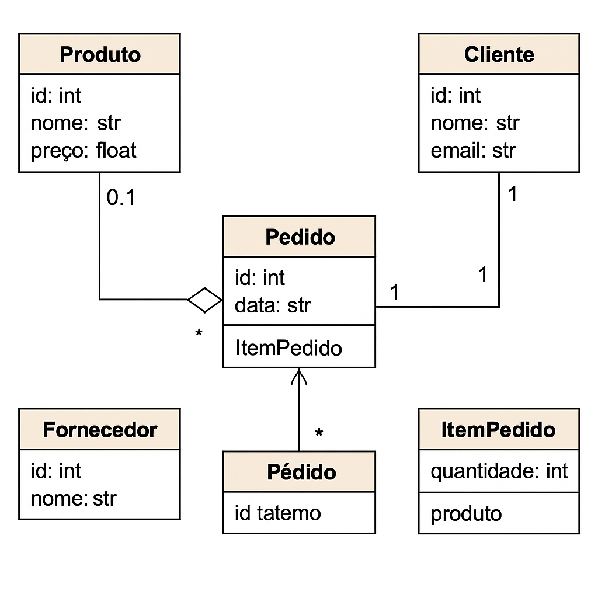
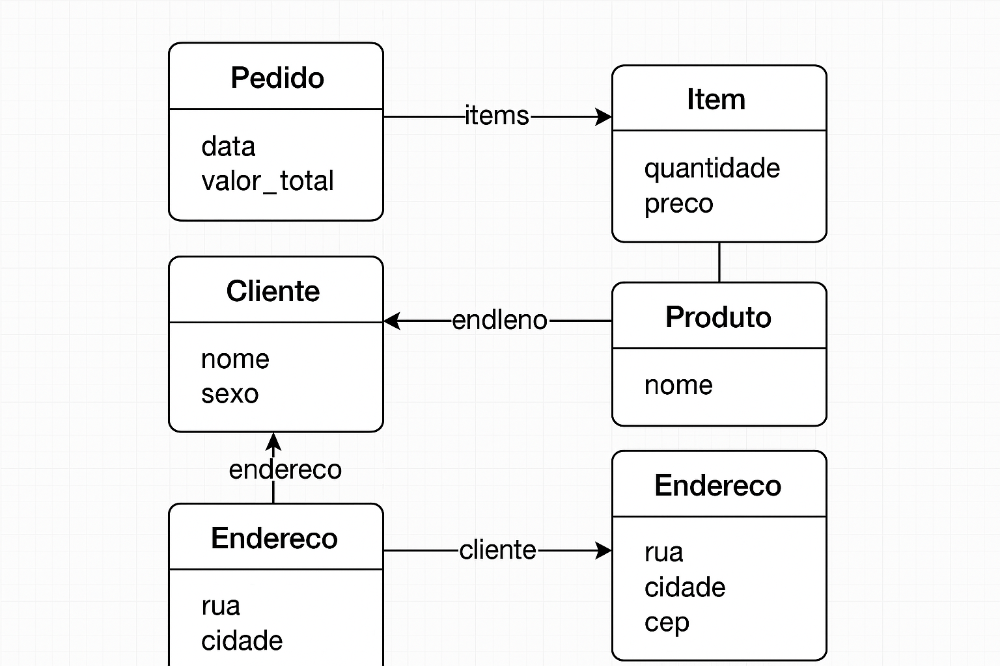

# Sistema de Integração de Dados e Análise Multicamadas

Este projeto tem como objetivo demonstrar a integração de diferentes tecnologias de banco de dados para fins de análise, modelagem e armazenamento de dados estruturados, semi-estruturados e conceituais.

---

## 🔧 Arquitetura do Sistema

### 🗄️ Camada de Persistência de Dados

- **PostgreSQL (Data Warehouse)**  
  Utilizado com modelagem em **esquema estrela** para análises OLAP. Armazena dados históricos de vendas.

- **MongoDB**  
  Armazena dados **semi-estruturados e não estruturados**, como comentários de clientes e vendas em formato documental.

- **ObjectDB (Modelagem Conceitual)**  
  Modelagem orientada a objetos, **não implementada tecnicamente**, mas utilizada como base para o projeto.

---

### 🔗 Camada de Integração (ETL e Consultas)

- **Extração:** dados simulados (scripts Python) representam vendas e feedbacks.
- **Transformação:** dados formatados e tratados (ex: cálculo de valor total da venda, normalização de nomes).
- **Carga:** 
  - dados enviados ao MongoDB usando `pymongo`.
  - dados organizados no PostgreSQL em modelo estrela.

---

## Modelagem de Dados

### PostgreSQL (Esquema Estrela)

- **Fato:** `fato_vendas`
- **Dimensões:** `dim_cliente`, `dim_produto`, `dim_localidade`, `dim_tempo`



### MongoDB

- Coleção **comentarios**
  - campos: `cliente_id`, `produto`, `avaliacao`, `comentario`, `data`
- Coleção **vendas**
  - campos: `cliente`, `produto`, `quantidade`, `valor_total`, `data`


### ObjectDB (Conceitual)

- classes modeladas: `Cliente`, `Produto`, `Venda`, `Comentario` (sem implementação prática)


---

## Execução do Sistema

### Pré-requisitos

pacotes:
```bash
pip install pymongo psycopg2 sqlalchemy